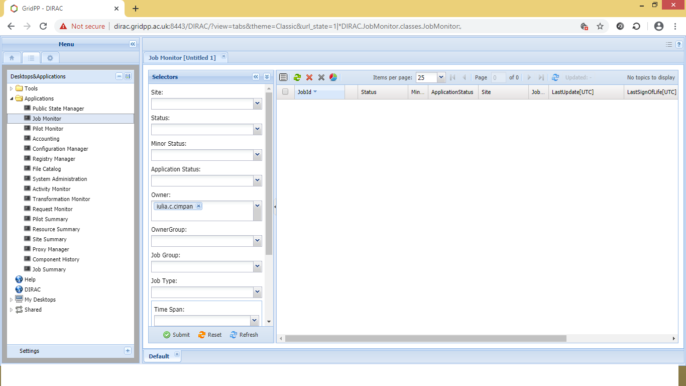

=============================
Signing up for IRIS Resources
=============================

Signing up to Galahad
======================

To get access to Galahad, please contact Anthony Holloway (email: anthony.holloway[at]manchester.ac.uk). A short introduction to Galahad will be provided (eg. 'home' and 'working' folders, accessing and loading available modules etc.) 

Signing up for Dirac/SAFE
==========================

	Registering on SAFE

	Registering on DiRAC

	Logging on to Cambridge HPC

`DiRAC <https://dirac.ac.uk>`_ is funded by the STFC and provides High Performance Computing (HPC) facilities. At present DiRAC HPC facilities are hosted at Cambridge, Durham, Edinburgh and Leicester Universities.

This document describes how to register to use the DiRAC HPC facility hosted at the University of Cambridge. The Cambridge HPC is described in detail `here <https://www.hpc.cam.ac.uk>`_. In order to use the Cambridge HPC facility users must first register on SAFE before applying for a DiRAC account.

.. _registerSAFE:

Registering on SAFE
-------------------

.. This follows <https://dirac-safe.readthedocs.io/en/latest/safe-guide-users.html#safe-registering-logging-in-passwords>_

#. Go to the SAFE `New User Signup Form <https://safe.epcc.ed.ac.uk/dirac/signup.jsp>`_

	.. _fig-SAFERegistration:
	.. figure:: images/SAFERegistration.png
		:width: 600
	
		The SAFE registration screen

#. Fill in your details
#. Click "Register" and (assuming you wish to continue) accept the terms and conditions
#. You will then be emailed a link allowing you to complete registration for SAFE and choose a password

After registering, should you need to change any of your details, go to `SAFE <https://safe.epcc.ed.ac.uk/dirac/>`_ and sign in using your email address and password.

.. _registerDIRAC:

Registering on DiRAC
--------------------

In order to register on DiRAC you must first have a SAFE account as described in :ref:`Registering on SAFE<registerSAFE>`. Registering for the Cambridge HPC will grant access to both Central Processing Unit (CPU) and Graphics Processing Unit (GPU) architectures. The CPU is designed to run quickly and handle a wide range of tasks but has limited concurrency whereas the GPU is designed to optimise rendering of images and can perform multiple parallel operations.

#. If not already logged in, log in to your SAFE account `here <https://safe.epcc.ed.ac.uk/dirac/>`__
#. Go to the `Request login account page <https://safe.epcc.ed.ac.uk/dirac/TransitionServlet/User//-/Transition=Choose%20Project>`_
#. Enter the project code ``tp001`` and click "Next"
#. Select ``Cambridge_HPC`` and click "Next"

	.. figure:: images/CambridgeDiracAccountRequest.png
		:width: 600

		The DiRAC account request screen

#. The next screen displays the username that will be assigned to you, make a note of this and click "Request".
#. You will receive an email once your request has been approved

Logging on to Cambridge HPC
---------------------------

#. In order to log on to the HPC for the first time find your password for the Cambridge HPC by logging in to your SAFE account `here <https://safe.epcc.ed.ac.uk/dirac/>`__ (if not already logged in)
#. Under the "Login Accounts" heading select "(username)@Cambridge_HPC" where username should be replaced with the name supplied during the DiRAC registration process. Click the button labelled "View Login Account Password" and make a note of the password displayed
#. Open a terminal command prompt and, replacing username with the name supplied during the DiRAC registration process, enter the following to access the CPU:

	.. code-block:: console

		(host) $ ssh (username)@login.hpc.cam.ac.uk

	or enter the following to access the GPU

	.. code-block:: console

		(host) $ ssh (username)@login-gpu.hpc.cam.ac.uk

#. When logging in to the CPU, if asked to accept one of the following fingerprints, type ``yes``

	* \MD5:eb:e3:a1:f0:64:68:cf:9c:63:da:84:db:2e:ee:15:83
	* \SHA256:nFVSXK+VRGCaUupQEdhXz06kp01m2fzzmbgPr0sc2so

	or when logging in to the GPU, if asked to accept one of the following fingerprints, type ``yes``

	* \MD5:fd:5c:6b:7d:49:95:2f:da:7f:5c:50:9a:bb:ef:3f:24
	* \SHA256:2rl+MXd9rsrDzFZwEItmhhiHTlLTIqN0d3TSGLTgjTI

	After accepting the fingerprint your computer will remember it when logging on in the future.

#. After logging in the first time you will be asked to choose a new password. This password will then be used for logging in to both CPU and GPU. Your password will *not* be visible in your SAFE account.

Your account has a storage allocation of 40GB in your home directory. Snapshots of your home directory are taken hourly/daily/weekly. If you delete a file by accident go to /home/.zfs/snapshot and browse the appropriate snapshot for the file which can then be copied back to your home directory.

Signing up to IRIS through certificate
=======================================
Introduction

-  get a grid certificate

-  join VO (Virtual Organisation)

-  access DIRAC in browser

-  install DIRAC UI

-  submit a job (python –version)

-  monitor a job

-  put data on the file catalog

-  submitting RASCIL job

-  get output data RASCIL job

-  useful links  

Get A Grid Certificate

-  a grid certificate is a .p12 file

-  Using your browser of choice visit `this page <https://portal.ca.grid-support.ac.uk>`_ and select the Request
   New User Certificate option. This almost goes without saying, but
   make sure you supply a valid email address which you can access. You
   will also be asked to do things like supply a PIN and passwords that
   you will need later on, so make sure you write everything down!

-  You will need to select a Registration Authority (RA) as part of this
   process.You may also be asked to supply a letter of recommendation
   explaining why you need to use the grid and with whom you will be
   working.

-  Details at    `grid_certificate <http://hep.ph.liv.ac.uk/~sjones/user-guides/getting-on-the-grid/grid-certificate.html>`__

Join a VO

-  Your grid certificate identifies you to the grid as an individual
   user, but it’s not enough on its own to allow you to use grid
   resources; you also need to join a Virtual Organisation (VO).

-  Note: I have made my request to skatelescope.eu - see   `Approved_Global_VOs <https://www.gridpp.ac.uk/wiki/GridPP_approved_VOs>`__

-  add the certificate to your browser and use the below link to register  `register_for_a_VO <https://voms.gridpp.ac.uk:8443/voms/skatelescope.eu/user/home.action>`__

Access DIRAC in browser

-  Now that you have the certificate and have joined to VO, you can add certificate to your browser and access DIRAC in browser   `DIRAC_in_browser <https://dirac.gridpp.ac.uk:8443/DIRAC/>`__

-  More details about DIRAC at Guide to DIRAC  `Guide_to_DIRAC <https://www.gridpp.ac.uk/wiki/Quick_Guide_to_Dirac#Server_URL>`__

DIRAC in Browser

   

Before DIRAC install
---------------------

Overview of directories on your server

.. code:: python

   /home/<your-user> - home directory

   /raid/scratch/<your-user> - a working directory, here DIRAC will be installed

   FC:/............................ - belongs to IRIS, can store large data. You need DIRAC installation to
   be able to copy files to FC:/ (IRIS)

DIRAC install
--------------

**Step 1:**  

.. code:: python
    
   - Switch to bash eg
   bash-4.2$ cat .bash_profile 
     #switch to bash
   setenv SHELL /usr/bin/bash
   exec /usr/bin/bash --login 
   
   bash-4.2$ /raid/scratch/<your-user> > mkdir dirac_ui
   bash-4.2$ /raid/scratch/<your-user> > cd dirac_ui/
   bash-4.2$ /raid/scratch/<your-user>/dirac_ui > mkdir $HOME/.globus
   bash-4.2$ /raid/scratch/<your-user>/dirac_ui >ls
   certBundle.p12
   #make sure you have the cert in this folder dirac_ui, eg certBundle.p12

**Step 2:**  

.. code:: python

   bash-4.2$ /raid/scratch/<your-user>/dirac_ui > openssl pkcs12 -in certBundle.p12 -clcerts -nokeys -out $HOME/.globus/usercert.pem
   Enter Import Password:
   MAC verified OK
   bash-4.2$ /raid/scratch/<your-user>/dirac_ui > openssl pkcs12 -in certBundle.p12 -nocerts -out $HOME/.globus/userkey.pem
   Enter Import Password:
   MAC verified OK
   Enter PEM pass phrase:
   Verifying - Enter PEM pass phrase:
   bash-4.2$ /raid/scratch/<your-user>/dirac_ui > chmod 0400 $HOME/.globus/userkey.pem

**Step 3:**  

.. code:: python

  bash-4.2$ /raid/scratch/<your-user>/dirac_ui > wget -np -O dirac-install https://raw.githubusercontent.com/DIRACGrid/management/master/dirac-install.py --no-check-certificate
  bash-4.2$ /raid/scratch/<your-user>/dirac_ui > chmod u+x dirac-install
  bash-4.2$ /raid/scratch/<your-user>/dirac_ui > ./dirac-install -r v7r1p45

**Step 4:**  

.. code:: python

   bash-4.2$ /raid/scratch/<your-user>/dirac_ui > source bashrc
   bash-4.2$ /raid/scratch/<your-user>/dirac_ui > dirac-proxy-init -x -N
   Generating proxy...
   Enter Certificate password:
   bash-4.2$ /raid/scratch/<your-user>/dirac_ui > export X509_VOMS_DIR="$DIRAC/etc/grid-security/vomsdir"
   bash-4.2$ /raid/scratch/<your-user>/dirac_ui > export X509_VOMSES="$DIRAC/etc/grid-security/vomses"
   bash-4.2$ /raid/scratch/<your-user>/dirac_ui > dirac-configure -F -S GridPP -C dips://dirac01.grid.hep.ph.ic.ac.uk:9135/Configuration/Server -I
   bash-4.2$ /raid/scratch/<your-user>/dirac_ui > dirac-proxy-init -g skatelescope.eu_user -M -U 
   #skatelescope.eu it is the VO I am assigned to
   Generating proxy...
   Enter Certificate password:

